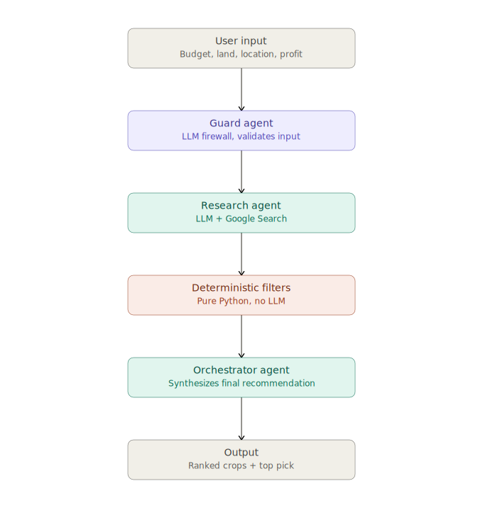
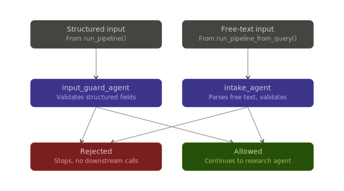
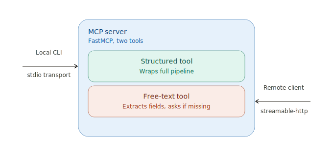

# Kaggriculture

**Farm Feasibility Advisor — a multi-agent system that turns budget, land, and location into a ranked, profit-backed crop recommendation.**

Built for the Kaggle 5-Day AI Agents Intensive capstone — **Agents for Good** track.

## The Problem

Smallholder and first-time farmers can't always afford an agronomist or market consultant before committing capital to a crop. The data needed to make a good call — local crop viability, current input costs, current market prices — exists, but it's scattered, requires research, and changes by season and region. It's especially acute somewhere like Qatar, where almost all viable agriculture is high-cost and climate-controlled, so a wrong crop choice burns real capital fast.

## The Solution

Kaggriculture takes a farmer's budget, land area, location, and target profit, researches real current crop options and prices for that region, filters out anything unaffordable, ranks the rest by ROI, and returns a recommendation with the numbers shown — not just "grow tomatoes," but exactly why.

**Two ways in:**
- Structured input (location, budget, land area, target profit, optional rent cost)
- Free text ("I want to grow something profitable in Qatar") — a dedicated agent extracts the structured fields, or asks for what's missing rather than guessing

## Architecture

```
                    User Input
                        │
       ┌────────────────┴────────────────┐
       │                                  │
  Structured args                    Free-text query
       │                                  │
input_guard_agent (LLM)            intake_agent (LLM)
  security check only          security check + field extraction
  rejects prompt injection /   rejects off-topic; asks follow-up
  off-topic input                questions if fields are missing
       │                                  │
       └────────────────┬─────────────────┘
                         ▼
              _run_core_pipeline()
                         │
                research_agent (LLM + Google Search)
                  finds crops + current prices for the region
                         │
                budget_filter() — pure Python, no LLM
                  drops crops over budget
                         │
                profit_ranker() — pure Python, no LLM
                  ranks survivors by profit / total_cost
                         │
                orchestrator_agent (LLM)
                  writes the plain-language recommendation
                  from the pre-computed numbers — never
                  recalculates them. Retries research_agent
                  up to 2x on invalid output.
                         ▼
              Ranked crop list + top recommendation
```



**Why two guard agents and not one?** They protect different attack surfaces. `input_guard_agent` only has to validate already-structured fields. `intake_agent` has to parse untrusted free text into those same fields *and* validate it in the same pass — so it's a separate agent with a separate, stricter prompt, not a shared one stretched to do both jobs.



## Course Concepts Demonstrated

| Concept | Where |
|---|---|
| Multi-agent system (ADK) | 4 distinct `LlmAgent`s — `input_guard_agent`, `intake_agent`, `research_agent`, `orchestrator_agent` — each single-purpose, wired through one shared core pipeline |
| Security | LLM firewall pattern (Day 4): every entry point is gated by a guard agent before any other agent runs. Verified against a deliberate prompt-injection input (rejected before `research_agent`/`orchestrator_agent` ever run) and an incomplete query, where `intake_agent` asked a follow-up question instead of guessing the missing budget/currency/land area/target profit |
| MCP Server | `mcp_server.py` (FastMCP) — two tools, `get_farm_recommendation` and `get_farm_recommendation_from_text`, served over `streamable-http` (locally and as the deployed remote MCP service) |
| Deployability | Two independent Cloud Run services — REST API and remote MCP — both live |

## Try It Live

- **REST API:** https://kaggriculture-90024527103.us-central1.run.app (`/docs` for Swagger UI)
- **Remote MCP:** https://kaggriculture-mcp-90024527103.us-central1.run.app/mcp — add as a Custom Connector in Claude Desktop, no local setup needed



## Inputs / Output

| Input | Required | Notes |
|---|---|---|
| Location | Yes | Country + region/state — drives climate fit and market prices |
| Budget | Yes | Total capital, in the currency specified by `currency` |
| Currency | Yes | e.g. "QAR", "USD" — research_agent is instructed to report every crop's prices in exactly this currency |
| Land area | Yes | In hectares |
| Target profit | Yes | Minimum acceptable return, same currency as budget |
| Rent cost | No | Only if land is rented; defaults to 0 |

**Output:** every crop that survives the budget filter, ranked by profit margin, plus a top recommendation with the full cost/profit breakdown.

**Profit margin formula:** `profit / total_cost` (ROI-style — "return on what I put in," not `profit / revenue`).

## Design Principles

- **Math is never done by an LLM.** `budget_filter()` and `profit_ranker()` are pure Python. LLMs are unreliable at arithmetic — every number the user sees was computed deterministically, not generated.
- **The orchestrator synthesizes, it doesn't recalculate.** It receives pre-ranked, pre-computed data and writes prose around it. Verified by exact-match testing against the filter/ranker output.
- **Currency and unit consistency are enforced by instruction**, not code — the caller supplies an explicit `currency` field, and `research_agent` is prompted to convert every crop's prices to exactly that currency, plus always normalize `unit_area` to hectares. The caller supplies `land_area` in hectares and `budget`/`target_profit` in `currency` to match.

## Setup

```bash
git clone https://github.com/Talal-Hassan-Programmer/kaggriculture.git
cd kaggriculture
python -m venv .venv
source .venv/bin/activate        # Windows: .venv\Scripts\activate
pip install -r requirements.txt
cp .env.example .env             # add your GEMINI_API_KEY
```

**Run locally:**
```bash
python main.py                   # single structured run
python main.py --interactive     # free-text, multi-round fill-in
uvicorn app:app --reload         # REST API on localhost:8000
python mcp_server.py             # MCP server, streamable-http on 0.0.0.0:$PORT (default 8080)
```

## Project Structure

```
kaggriculture/
├── main.py                    # CLI entry point, --interactive mode
├── filters.py                 # budget_filter(), profit_ranker() — pure Python
├── app.py                     # FastAPI REST API
├── mcp_server.py              # FastMCP server, streamable-http transport
├── search_tool.py             # Step 2 standalone verification script (not used in production)
├── agents/
│   ├── input_guard_agent.py   # LLM firewall — structured entry point
│   ├── intake_agent.py        # LLM firewall + field extraction — free-text entry point
│   ├── research_agent.py      # ADK LlmAgent + google_search tool
│   └── orchestrator.py        # synthesizes recommendation, retry loop
├── adk_demo/                  # isolated single-agent demo apps (for `adk web`)
├── docs/diagrams/             # architecture diagrams embedded above
├── Dockerfile                 # REST API service (app.py)
├── Dockerfile.mcp             # MCP service (mcp_server.py) — separate Cloud Run deploy
├── requirements.txt
└── .env.example
```

## Limitations / Known Risks

- `land_area` must be supplied in hectares — `research_agent` is instructed to normalize to hectares, but nothing checks the caller actually sent hectares; a caller assuming acres or dunams gets silently wrong math.
- Currency conversion relies on `research_agent` doing a live exchange-rate lookup via Google Search whenever its source data is in a different currency than requested — like all live-search data, this can vary run to run and hasn't been spot-checked against a reference exchange rate.
- Market prices come from live Google Search grounding — the same query can return different numbers run to run as underlying search results change.
- Demo/testing has been concentrated on one region (Al Rayyan, Qatar); other regions are untested in practice, though the pipeline is region-agnostic by design.

## Video & Writeup

<!-- TODO: link YouTube video once published -->
<!-- TODO: link Kaggle writeup once published -->

## License

Code released under **CC-BY 4.0**, per Kaggle 5-Day AI Agents Intensive competition terms.

## Built For

Kaggle 5-Day AI Agents Intensive (with Google) — **Agents for Good** track.
